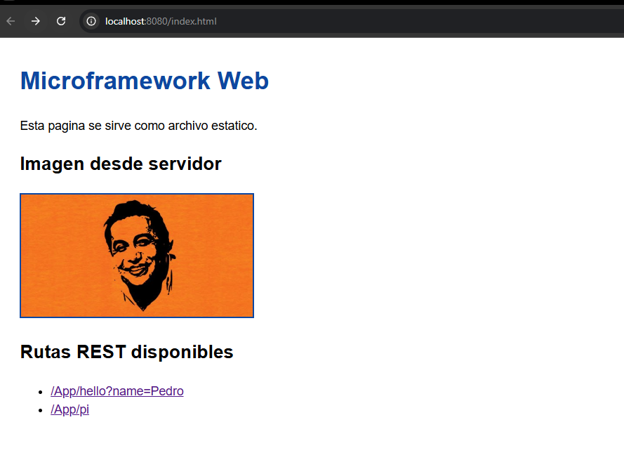

# Microframeworks-WEB

Micro framework HTTP en Java (Maven) para publicar servicios REST `GET` con lambdas y servir archivos estaticos.

## Objetivo del proyecto

El framework extiende un servidor HTTP basico para soportar:

- Registro de rutas REST con `get(path, lambda)`.
- Extraccion de query params desde el request (`req.getValues("name")`).
- Configuracion de carpeta de archivos estaticos (`staticfiles("/webroot")`).

## Arquitectura

El proyecto esta dividido en capas simples:

- `edu.escuelaing.arep.microframework.MicroWeb`
  - API publica del framework (`get`, `staticfiles`, `port`, `start`).
- `edu.escuelaing.arep.microframework.server.HttpServerEngine`
  - Loop principal con `ServerSocket`, parsing de request y construccion de response HTTP.
- `edu.escuelaing.arep.microframework.http`
  - Modelos `Request`/`Response` y sus implementaciones.
- `edu.escuelaing.arep.microframework.staticfiles.StaticFileHandler`
  - Resolucion de archivos estaticos desde `src/main/resources`.
- `edu.escuelaing.arep.demo.Main`
  - Aplicacion ejemplo que consume el framework.

## Estructura

```text
src/
  main/
    java/edu/escuelaing/arep/
      demo/Main.java
      microframework/
        MicroWeb.java
        server/HttpServerEngine.java
        http/{Request,Response,RequestImpl,ResponseImpl}.java
        routing/Route.java
        staticfiles/StaticFileHandler.java
    resources/webroot/
      index.html
      styles.css
  test/
    java/edu/escuelaing/arep/microframework/
      http/RequestImplTest.java
      staticfiles/StaticFileHandlerTest.java
```

## Requisitos

- Java 17+
- Maven 3.9+

## Como ejecutar

1. Compilar y correr pruebas:

```bash
mvn clean test
```

2. Iniciar el servidor demo:

```bash
mvn exec:java
```

3. Probar en navegador o cliente HTTP:

- `http://localhost:8080/index.html`
- `http://localhost:8080/App/hello?name=Pedro`
- `http://localhost:8080/App/pi`

## Ejemplo de uso del framework

`Main.java`:

```java
staticfiles("/webroot");
get("/App/hello", (req, resp) -> "Hello " + req.getValues("name"));
get("/App/pi", (req, resp) -> String.valueOf(Math.PI));
port(8080);
start();
```

## Pruebas implementadas

- `RequestImplTest`
  - Parsing de query params.
  - Decoding de caracteres URL (`%20`).
  - Soporte de valores vacios.
- `StaticFileHandlerTest`
  - Carga de `index.html`.
  - Fallback de `/` hacia `/index.html`.
  - Deteccion de content type para CSS.

## Entregables

El código fuente del proyecto desarrollado fue cargado a un repositorio GitHub público. El proyecto está construido usando **Maven** y **Git**. El README describe el proyecto, su arquitectura, cómo ejecutarlo y ejemplos de pruebas realizadas. El repositorio está estructurado de manera profesional.

### Estructura profesional del repositorio

```text
├── .git/                           # Control de versiones Git
├── .gitignore                      # Archivos ignorados
├── pom.xml                         # Configuración Maven
├── README.md                       # Documentación (este archivo)
├── docs/
│   ├── architecture.md             # Descripción de arquitectura
│   └── rubric-checklist.md         # Checklist de requisitos
├── src/
│   ├── main/
│   │   ├── java/                   # Código fuente del framework
│   │   └── resources/webroot/      # Archivos estáticos (HTML, CSS, JS, imágenes)
│   └── test/
│       └── java/                   # Pruebas unitarias
└── target/                         # Compilados (Maven)
```

### Tecnologías y herramientas

- **Java 17+** – Lenguaje de programación
- **Maven 3.9+** – Gestor de dependencias y construcción
- **Git** – Control de versiones
- **JUnit 5** – Framework de pruebas unitarias

## Evidencia de funcionalidad

### Servidor sirviendo archivos estáticos

La siguiente imagen evidencia que el microframework está sirviendo correctamente archivos estáticos (HTML, CSS, imágenes):



### Endpoints de prueba disponibles

Con el servidor en ejecución (`mvn exec:java`), es posible probar:

1. **Archivos estáticos**: `http://localhost:8080/index.html`
2. **API REST con query params**: `http://localhost:8080/App/hello?name=Pedro` → responde `"Hello Pedro"`
3. **API REST simple**: `http://localhost:8080/App/pi` → responde `"3.141592653589793"`
4. **Contenido dinámico con imágenes**: La página `index.html` incluye `dio2.png` servida como estático

## Resultados de pruebas

### Pruebas unitarias

Al ejecutar `mvn clean test`, se ejecutan las siguientes pruebas:

```
Tests run: 5, Failures: 0, Errors: 0, Skipped: 0
BUILD SUCCESS
```

**Pruebas implementadas:**

| Prueba | Descripción |
|--------|-------------|
| `RequestImplTest.shouldParseAndDecodeQueryParams()` | Valida parsing y decoding de parámetros de query (ej. `name=Pedro%20Perez`) |
| `RequestImplTest.shouldHandleEmptyValue()` | Valida soporte de valores vacíos en parámetros |
| `StaticFileHandlerTest.shouldLoadIndexHtmlFromConfiguredRoot()` | Valida carga de archivos estáticos desde `src/main/resources/webroot` |
| `StaticFileHandlerTest.shouldResolveDefaultIndexForRootPath()` | Valida que `/` resuelva a `/index.html` |
| `StaticFileHandlerTest.shouldDetectCssContentType()` | Valida detección automática de `Content-Type` para CSS |

### Pruebas funcionales manuales

#### 1. Servicio REST con query parameters
```bash
curl -i "http://localhost:8080/App/hello?name=Pedro"
# Respuesta esperada: HTTP/1.1 200 OK
# Body: "Hello Pedro"
```

#### 2. Servicio REST simple (cálculo)
```bash
curl -i "http://localhost:8080/App/pi"
# Respuesta esperada: HTTP/1.1 200 OK
# Body: "3.141592653589793"
```

#### 3. Archivo estático HTML
```bash
curl -i "http://localhost:8080/index.html"
# Respuesta esperada: HTTP/1.1 200 OK
# Content-Type: text/html; charset=UTF-8
# Body: HTML con imagen dio2.png integrada
```

#### 4. Archivo de imagen servido como estático
```bash
curl -i "http://localhost:8080/dio2.png"
# Respuesta esperada: HTTP/1.1 200 OK
# Content-Type: image/png
```

#### 5. Validación de rutas no existentes (404)
```bash
curl -i "http://localhost:8080/ruta/inexistente"
# Respuesta esperada: HTTP/1.1 404 Not Found
```

## Cómo contribuir

1. Clonar el repositorio
2. Crear una rama (`git checkout -b feature/mejora`)
3. Hacer cambios y commits
4. Pushear la rama y crear un Pull Request

## Notas de implementación

- El servidor utiliza `ServerSocket` nativo de Java (sin frameworks HTTP externos) para máxima pedagogía.
- El parsing HTTP es manual, permitiendo entender el protocolo en profundidad.
- Los handlers son expresiones lambda (`Route`), facilitando código limpio y funcional.
- Los archivos estáticos se cargan desde el classpath (`src/main/resources`), optimizando distribución en JAR.
